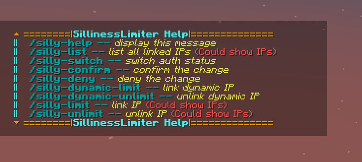
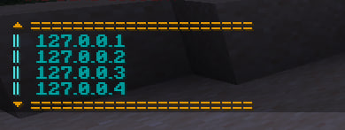

# **SillinessLimiter**

## Description

SillinessLimiter is a little strange ip based auth with the intention of providing an easy choice to the player
of how they want to secure their account on an offline server while also not being annoying

Also includes customizable language file and dynamic IP support

This plugin doesn't use any of the NMS stuff, so it should work on other versions too

However, tested versions can be found on [Modrinth page](https://modrinth.com/plugin/sillinesslimiter/versions)

## Commands

#### _/silly-help_
-- displays in-game command documentation, only including basic ones 

  
permission: nnhomoli.sillinesslimiter.cmds.sillyhelp
#### _/silly-limit_ 
-- links your account to IP address you are currently on, needs confirmation. Can be used with an argument to link a specific IP

permission: nnhomoli.sillinesslimiter.cmds.sillylimit
#### _/silly-unlimit_ 
-- if linked, it unlinks your account from the currently used IP and needs confirmation. Can be used with an argument to unlink a specific IP

permission: nnhomoli.sillinesslimiter.cmds.sillyunlimit
#### _/silly-list_ 
-- shows the list of linked IPs to your account

permission: nnhomoli.sillinesslimiter.cmds.sillylist
#### _/silly-confirm_
-- just to confirm changes, nothing else

permission: nnhomoli.sillinesslimiter.cmds.sillyconfirm
#### _/silly-deny_
-- just to deny changes, nothing else

permission: nnhomoli.sillinesslimiter.cmds.sillydeny
#### _/silly-reload_
-- config and language reload, server op and console only

permission: nnhomoli.sillinesslimiter.cmds.sillyreload
#### _/silly-switch_
-- switches the auth status for the user individually, needs confirmation

permission: nnhomoli.sillinesslimiter.cmds.sillyswitch
#### _/silly-dynamic-limit_
-- links your account to the dynamic ip, supports arguments. If used without arguments, will default to the second octet of current IP, needs confirmation

permission: nnhomoli.sillinesslimiter.cmds.sillydynamiclimit
#### _/silly-dynamic-unlimit_
-- unlinks the dynamic ip from your account, needs confirmation 

permission: nnhomoli.sillinesslimiter.cmds.sillydynamicunlimit
___
## **Config**

#### _Permission-by-default_ ## true/false
-- grants every permission of this plugin commands, except reload, true by default

#### _Login-link-message_ ## true/false
-- Display a message when player whose IP is not linked joins, can be changed in [lang.yml](src%2Fmain%2Fresources%2Fdefault%2Flang.yml), true by default

#### _Max-IP-Allowed_ ## Int value
-- The maximum number of IP that can be linked to the same account, 4 by default

#### _check-after-confirm_ ## true/false
-- Check if player IP is still linked after confirm, false by default

## Language
-- For more info about this one, check [lang.yml](src%2Fmain%2Fresources%2Fdefault%2Flang.yml)

## Player data
-- For more info about this one, check [data.yml](src%2Fmain%2Fresources%2Fdefault%2Fdata.yml)

___
# **Official pages**

-- **modrinth:** 

https://modrinth.com/plugin/sillinesslimiter

-- **planetminecraft**: 

https://www.planetminecraft.com/mod/sillinesslimiter-a-little-strange-ip-based-auth-bukkit-1-20-4-120-6/
